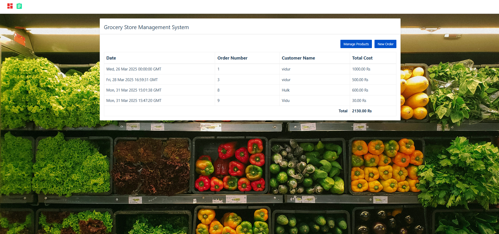

# Grocery Store Management Website

## Overview
The Grocery Store Management Website is a web-based application designed to help grocery store owners manage their inventory and orders efficiently. The system follows a **3-tier software architecture**, separating the UI, backend, and database for better scalability and maintainability. It is developed using **Scrum-based Agile methodology** to ensure iterative development and continuous improvements based on user feedback.

## Home Page



## Technology Stack
- **Frontend:** HTML, CSS, JavaScript, Bootstrap
- **Backend:** Python Flask Server
- **Database:** MySQL

## Features
### **Products Module**
- Add new products
- Delete existing products
- Edit product details (**To be implemented**)
- Manage Units of Measurement (UOM) (**Implemented**)

### **Orders Module**
- Create new orders
- View all orders
- Validate order details before submission (**To be implemented**)
- Fix total price calculation bug (**To be implemented**)
- View order details with item breakdown (**To be implemented**)

## Project Structure
The project follows a structured format with separate folders for backend, frontend UI, and environment settings:
```
/ GroceryStoreManagement
│── /backend                # Python Flask Backend
│   │── establish_connection.py  # Database connection
│   │── orders_dao.py            # Orders data access layer
│   │── products_dao.py          # Products data access layer
│   │── units_dao.py             # UOM data access layer
│   │── server.py                # Main backend server
│── /ui                     # Frontend UI
│   │── /css                # Stylesheets
│   │   │── custom.css      # Custom styles
│   │   │── style.css       # General styles
│   │── /images             # Image assets
│   │   │── bg.jpg          # Background image
│   │── /js                 # JavaScript Files
│   │   │── /custom         # Custom JS scripts
│   │   │   │── common.js   # Common utilities
│   │   │   │── dashboard.js# Dashboard scripts
│   │   │   │── manage-product.js # Product management scripts
│   │   │   │── order.js    # Order management scripts
│   │── /packages           # Additional frontend resources
│   │── index.html          # Main HTML file
│   │── manage-product.html # Product page
│   │── order.html          # Order page
│── /env                    # Virtual Environment Files
```

## Usage
- **Products Page:** Manage products and UOMs.
- **Orders Page:** View and manage orders.
- **New Order Page:** Create a new order.

## Future Enhancements
- **Edit product details** feature.
- **Order validation** before submission.
- **Fix total price calculation bug**.
- **View order details** with breakdown.

## Installation and Setup
### Prerequisites
- Python 3.x
- MySQL Server
- Virtual Environment (optional but recommended)

### Steps to Run the Project
1. Clone the repository:
   ```bash
   git clone https://github.com/your-repo/grocery-store-management.git
   cd grocery-store-management
   ```
2. Create a virtual environment and activate it:
   ```bash
   python -m venv venv
   source venv/bin/activate   # On Windows: venv\Scripts\activate
   ```
3. Install dependencies:
   ```bash
   pip install -r requirements.txt
   ```
4. Set up MySQL database:
   - Create a database in MySQL.
   - Update `config.py` with your database credentials.
   - Run migration scripts in `/database`.
5. Run the Flask server:
   ```bash
   python app.py
   ```
6. Open your browser and navigate to:
   ```
   http://127.0.0.1:5000/
   ```

## Contributing
Contributions are welcome! Please follow these steps:
1. Fork the repository.
2. Create a new branch.
3. Implement your changes and commit.
4. Push your branch and create a pull request.
